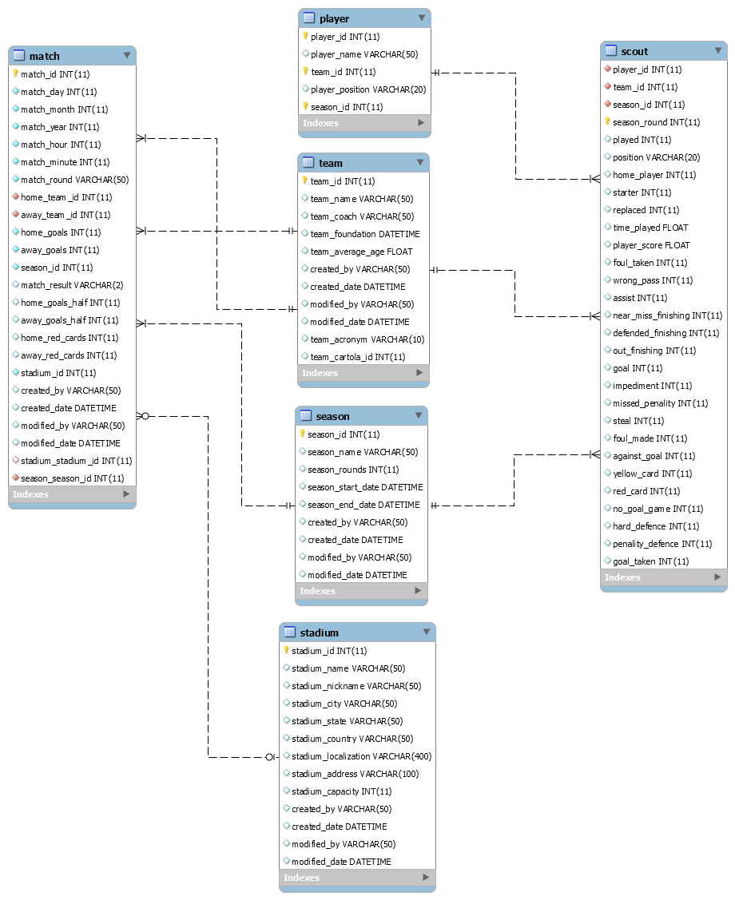

# Banco de Dados do Campeonato Brasileiro

## Modelo Físico

## Dicionário de Dados

### Tabela match (partida)
| #  | Nome Coluna          | Tipo de Dados | Tipo Chave | Aceita Nulo? | Descrição                                |
|----|----------------------|---------------|------------|--------------|------------------------------------------|
| 1  | match_id             | int(11)       | PRI        | NO           | ID da partida                            |
| 2  | match_day            | int(11)       |            | NO           | Dia da partida                           |
| 3  | match_month          | int(11)       |            | NO           | Mês da partida                           |
| 4  | match_year           | int(11)       |            | NO           | Ano da partida                           |
| 5  | match_hour           | int(11)       |            | NO           | Hora da partida                          |
| 6  | match_minute         | int(11)       |            | NO           | Minuto da partida                        |
| 7  | match_round          | int(11)       |            | NO           | Rodada                                   |
| 8  | home_team_id         | int(11)       |            | NO           | ID do time da casa                       |
| 9  | away_team_id         | int(11)       |            | NO           | ID do time visitante                     |
| 10 | home_goals           | int(11)       |            | NO           | Gols do time da casa                     |
| 11 | away_goals           | int(11)       |            | NO           | Gols do time visitante                   |
| 12 | season_id            | int(11)       |            | NO           | Temporada                                |
| 13 | match_result         | varchar(2)    |            | YES          | Resultado da partida                     |
| 14 | home_goals_half      | int(11)       |            | YES          | Gols do time da casa no primeiro tempo   |
| 15 | away_goals_half      | int(11)       |            | YES          | Gols do time visitante no primeiro tempo |
| 16 | home_red_cards       | int(11)       |            | YES          | Cartões vermelhos do time da casa        |
| 17 | away_red_cards       | int(11)       |            | YES          | Cartões vermelhos do time visitante      |
| 18 | stadium_id           | int(11)       |            | NO           | ID do estádio                            |
| 19 | created_by           | varchar(50)   |            | YES          | Criador do registro                      |
| 20 | created_date         | datetime      |            | YES          | Data do registro                         |
| 21 | modified_by          | varchar(50)   |            | YES          | Modificador do registro                  |
| 22 | modified_date        | datetime      |            | YES          | Data da modificação                      |

### Tabela player (jogador)
| #  | Nome Coluna          | Tipo de Dados | Tipo Chave | Aceita Nulo? | Descrição                                |
|----|----------------------|---------------|------------|--------------|------------------------------------------|
| 1  | player_id            | int(11)       | PRI        | NO           | ID do jogador                            |
| 2  | player_name          | varchar(50)   |            | YES          | Nome do jogador                          |
| 3  | team_id              | int(11)       |            | YES          | ID do time do jogador                    |
| 4  | player_position      | varchar(20)   |            | YES          | Posição do jogador                       |
| 5  | season_id            | int(11)       | PRI        | NO           | Temporada                                |

### Tabela scout (estatísticas do jogador)
| #  | Nome Coluna          | Tipo de Dados | Tipo Chave | Aceita Nulo? | Descrição                                |
|----|----------------------|---------------|------------|--------------|------------------------------------------|
| 1  | player_id            | int(11)       | PRI        | NO           | ID do jogador                            |
| 2  | team_id              | int(11)       | PRI        | NO           | ID do time                               |
| 3  | season_id            | int(11)       | PRI        | NO           | Temporada                                |
| 4  | season_round         | int(11)       | PRI        | NO           | Rodada                                   |
| 5  | played               | int(11)       |            | YES          | Jogou?                                   |
| 6  | position             | varchar(20)   |            | YES          | Posição do jogador                       |
| 7  | home_player          | int(11)       |            | YES          | Time da casa                             |
| 8  | starter              | int(11)       |            | YES          | Iniciou jogando                          |
| 9  | replaced             | int(11)       |            | YES          | Foi substituído                          |
| 10 | time_played          | float         |            | YES          | Tempo jogado                             |
| 11 | player_score         | float         |            | YES          | Score do jogador                         |
| 12 | foul_taken           | int(11)       |            | YES          | Faltas recebidas pelo jogador            |
| 13 | wrong_pass           | int(11)       |            | YES          | Passes errados do jogador                |
| 14 | assist               | int(11)       |            | YES          | Assistências do jogador                  |
| 15 | near_miss_finishing  | int(11)       |            | YES          | Chutes "na trave"                        |
| 16 | defended_finishing   | int(11)       |            | YES          | Chutes defendidos                        |
| 17 | out_finishing        | int(11)       |            | YES          | Chutes para fora                         |
| 18 | goal                 | int(11)       |            | YES          | Gols                                     |
| 19 | impediment           | int(11)       |            | YES          | Impedimentos                             |
| 20 | missed_penality      | int(11)       |            | YES          | Penaltis perdidos                        |
| 21 | steal                | int(11)       |            | YES          | Roubadas de bola                         |
| 22 | foul_made            | int(11)       |            | YES          | Faltas cometidas                         |
| 23 | against_goal         | int(11)       |            | YES          | Gols contra                              |
| 24 | yellow_card          | int(11)       |            | YES          | Cartões amarelos                         |
| 25 | red_card             | int(11)       |            | YES          | Cartões vermelhos                        |
| 26 | no_goal_game         | int(11)       |            | YES          | Jogo sem gol                             |
| 27 | hard_defence         | int(11)       |            | YES          | Defesa difícil                           |
| 28 | penality_defence     | int(11)       |            | YES          | Penalti defendido                        |
| 29 | goal_taken           | int(11)       |            | YES          | Gols sofridos                            |

### Tabela season (temporada)
| #  | Nome Coluna          | Tipo de Dados | Tipo Chave | Aceita Nulo? | Descrição                                |
|----|----------------------|---------------|------------|--------------|------------------------------------------|
| 1  | season_id            | int(11)       | PRI        | NO           | ID da Temporada                          |
| 2  | season_name          | varchar(50)   |            | YES          | Nome                                     |
| 3  | season_rounds        | int(11)       |            | YES          | Número de Rodadas                        |
| 4  | season_start_date    | datetime      |            | YES          | Data de Início                           |
| 5  | season_end_date      | datetime      |            | YES          | Data de Término                          |

### Tabela stadium (estádio)
| #  | Nome Coluna          | Tipo de Dados | Tipo Chave | Aceita Nulo? | Descrição                                |
|----|----------------------|---------------|------------|--------------|------------------------------------------|
| 1  | stadium_id           | int(11)       | PRI        | NO           | ID do Estádio                            |
| 2  | stadium_name         | varchar(50)   |            | YES          | Nome do Estádio                          |
| 3  | stadium_nickname     | varchar(50)   |            | YES          | Apelido                                  |
| 4  | stadium_city         | varchar(50)   |            | YES          | Cidade                                   |
| 5  | stadium_state        | varchar(50)   |            | YES          | Estado                                   |
| 6  | stadium_country      | varchar(50)   |            | YES          | País                                     |
| 7  | stadium_localization | varchar(400)  |            | YES          | Localização                              |
| 8  | stadium_address      | varchar(100)  |            | YES          | Endereço                                 |
| 9  | stadium_capacity     | int(11)       |            | YES          | Capacidade                               |

### Tabela team (time)
| #  | Nome Coluna          | Tipo de Dados | Tipo Chave | Aceita Nulo? | Descrição                                |
|----|----------------------|---------------|------------|--------------|------------------------------------------|
| 1  | team_id              | int(11)       | PRI        | NO           | ID do time                               |
| 2  | team_name            | varchar(50)   |            | YES          | Nome do time                             |
| 3  | team_coach           | varchar(50)   |            | YES          | Treinador Atual                          |
| 4  | team_foundation      | datetime      |            | YES          | Data de Fundação                         |
| 5  | team_average_age     | float         |            | YES          | Média de idade                           |
| 6  | team_acronym         | varchar(10)   |            | YES          | Acrônimo                                 |
| 7  | team_cartola_id      | int(11)       |            | YES          | ID no cartola                            |