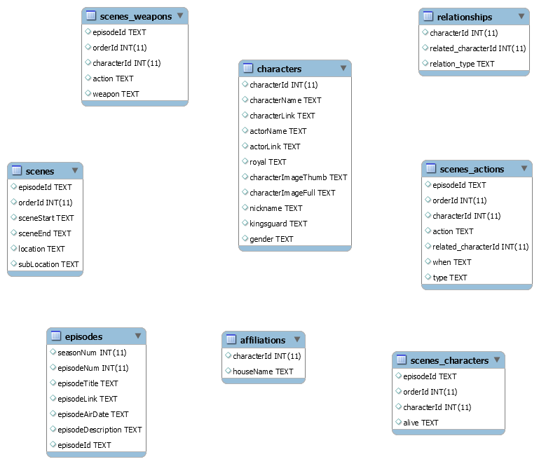

# Banco de Dados do Campeonato Brasileiro

## Modelo Físico

## Dicionário de Dados

### Tabela affiliations (afiliações)
| #  | Nome Coluna         | Tipo de Dados | Tipo Chave | Aceita Nulo? | Descrição                              |
|----|---------------------|---------------|------------|--------------|----------------------------------------|
| 1  | characterId         | int(11)       |            | YES          | Id do personagem                       |
| 2  | houseName           | text          |            | YES          | Casa de GOT                            |

### Tabela characters (personagens)
| #  | Nome Coluna         | Tipo de Dados | Tipo Chave | Aceita Nulo? | Descrição                              |
|----|---------------------|---------------|------------|--------------|----------------------------------------|
| 1  | characterId         | int(11)       |            | YES          | ID do personagem                       |
| 2  | characterName       | text          |            | YES          | Nome                                   |
| 3  | characterLink       | text          |            | YES          | URL para personagem no IMDB            |
| 4  | actorName           | text          |            | YES          | Nome do ator                           |
| 5  | actorLink           | text          |            | YES          | URL para ator no IMDB                  |
| 6  | royal               | text          |            | YES          | É da realeza?                          |
| 7  | characterImageThumb | text          |            | YES          | URL para imagem pequena do personagem  |
| 8  | characterImageFull  | text          |            | YES          | URL para imagem grande do personagem   |
| 9  | nickname            | text          |            | YES          | Apelido                                |
| 10 | kingsguard          | text          |            | YES          | É da guarda do rei?                    |
| 11 | gender              | text          |            | YES          | Gênero                                 |

### Tabela episodes (episódios)
| #  | Nome Coluna         | Tipo de Dados | Tipo Chave | Aceita Nulo? | Descrição                              |
|----|---------------------|---------------|------------|--------------|----------------------------------------|
| 1  | seasonNum           | int(11)       |            | YES          | Temporada                              |
| 2  | episodeNum          | int(11)       |            | YES          | Episódio                               |
| 3  | episodeTitle        | text          |            | YES          | Título do Episódio                     |
| 4  | episodeLink         | text          |            | YES          | URL para Episódio no IMDB              |
| 5  | episodeAirDate      | text          |            | YES          | Data do Episódio                       |
| 6  | episodeDescription  | text          |            | YES          | Descrição do Episódio                  |
| 7  | episodeId           | text          |            | YES          | ID do episódio                         |

### Tabela relationships (relacionamentos)
| #  | Nome Coluna         | Tipo de Dados | Tipo Chave | Aceita Nulo? | Descrição                              |
|----|---------------------|---------------|------------|--------------|----------------------------------------|
| 1  | characterId         | int(11)       |            | YES          | ID do personagem                       |
| 2  | related_characterId | int(11)       |            | YES          | ID do personagem com quem se relaciona |
| 3  | relation_type       | text          |            | YES          | Tipo de relação                        |

### Tabela scenes (cenas)
| #  | Nome Coluna         | Tipo de Dados | Tipo Chave | Aceita Nulo? | Descrição                              |
|----|---------------------|---------------|------------|--------------|----------------------------------------|
| 1  | episodeId           | text          |            | YES          | ID do episódio                         |
| 2  | orderId             | int(11)       |            | YES          | Ordem                                  |
| 3  | sceneStart          | text          |            | YES          | Início da Cena                         |
| 4  | sceneEnd            | text          |            | YES          | Fim da Cena                            |
| 5  | location            | text          |            | YES          | Locação                                |
| 6  | subLocation         | text          |            | YES          | Sublocação                             |

### Tabela scenes_actions (ações em cena)
| #  | Nome Coluna         | Tipo de Dados | Tipo Chave | Aceita Nulo? | Descrição                              |
|----|---------------------|---------------|------------|--------------|----------------------------------------|
| 1  | episodeId           | text          |            | YES          | ID do episódio                         |
| 2  | orderId             | int(11)       |            | YES          | Ordem                                  |
| 3  | characterId         | int(11)       |            | YES          | ID do personagem                       |
| 4  | action              | text          |            | YES          | Ação                                   |
| 5  | related_characterId | int(11)       |            | YES          | ID do personagem relacionado           |
| 6  | when                | text          |            | YES          | Quando                                 |
| 7  | type                | text          |            | YES          | Tipo de ação                           |

### Tabela scenes_characters (personagens em cena)
| #  | Nome Coluna         | Tipo de Dados | Tipo Chave | Aceita Nulo? | Descrição                              |
|----|---------------------|---------------|------------|--------------|----------------------------------------|
| 1  | episodeId           | text          |            | YES          | ID do episódio                         |
| 2  | orderId             | int(11)       |            | YES          | Ordem                                  |
| 3  | characterId         | int(11)       |            | YES          | ID do personagem                       |
| 4  | alive               | text          |            | YES          | Estava vivo?                           |

### Tabela scenes_weapons (armas em cena)
| #  | Nome Coluna         | Tipo de Dados | Tipo Chave | Aceita Nulo? | Descrição                              |
|----|---------------------|---------------|------------|--------------|----------------------------------------|
| 1  | episodeId           | text          |            | YES          | ID do episódio                         |
| 2  | orderId             | int(11)       |            | YES          | Ordem                                  |
| 3  | characterId         | int(11)       |            | YES          | ID do personagem                       |
| 4  | action              | text          |            | YES          | Ação                                   |
| 5  | weapon              | text          |            | YES          | Arma                                   |