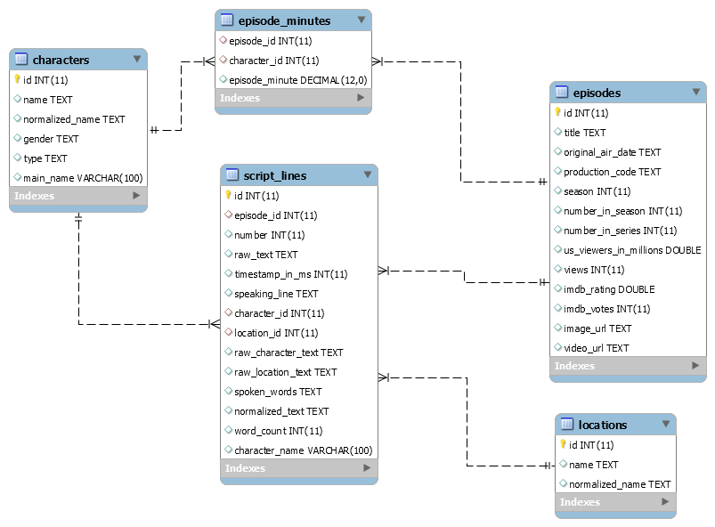

# Banco de Dados dos Simpsons

## Modelo Físico

## Dicionário de Dados

### Tabela characters (personagens)
| #  | Nome Coluna            | Tipo de Dados | Tipo Chave | Aceita Nulo? | Descrição                          |
|----|------------------------|---------------|------------|--------------|------------------------------------|
| 1  | id                     | int(11)       | PRI        | NO           | ID do personagem                   |
| 2  | name                   | text          |            | YES          | Nome                               |
| 3  | normalized_name        | text          |            | YES          | Nome normalizado                   |
| 4  | gender                 | text          |            | YES          | Gênero                             |
| 5  | type                   | text          |            | YES          | Tipo                               |
| 6  | main_name              | varchar(100)  |            | YES          | Nome do personagem principal       |

### Tabela episode_minutes (personagens por minuto do episódio)
| #  | Nome Coluna            | Tipo de Dados | Tipo Chave | Aceita Nulo? | Descrição                          |
|----|------------------------|---------------|------------|--------------|------------------------------------|
| 1  | episode_id             | int(11)       | MUL        | YES          | ID do episódio                     |
| 2  | character_id           | int(11)       | MUL        | YES          | ID do personagem                   |
| 3  | episode_minute         | decimal(12,0) |            | YES          | Minuto do episódio                 |

### Tabela episodes (episódios)
| #  | Nome Coluna            | Tipo de Dados | Tipo Chave | Aceita Nulo? | Descrição                          |
|----|------------------------|---------------|------------|--------------|------------------------------------|
| 1  | id                     | int(11)       | PRI        | NO           | ID do episódio                     |
| 2  | title                  | text          |            | YES          | Título                             |
| 3  | original_air_date      | text          |            | YES          | Data em que foi ao ar              |
| 4  | production_code        | text          |            | YES          | Código de produção                 |
| 5  | season                 | int(11)       |            | YES          | Temporada                          |
| 6  | number_in_season       | int(11)       |            | YES          | Número do episódio na temporada    |
| 7  | number_in_series       | int(11)       |            | YES          | Número do episódio na série        |
| 8  | us_viewers_in_millions | double        |            | YES          | Espectadores nos US em milhões     |
| 9  | views                  | int(11)       |            | YES          | Número de views                    |
| 10 | imdb_rating            | double        |            | YES          | Nota do IMDB                       |
| 11 | imdb_votes             | int(11)       |            | YES          | Votos no IMDB                      |
| 12 | image_url              | text          |            | YES          | URL de imagem do episódio          |
| 13 | video_url              | text          |            | YES          | URL de vídeo (trailer) do episódio |

### Tabela locations (locações)
| #  | Nome Coluna            | Tipo de Dados | Tipo Chave | Aceita Nulo? | Descrição                          |
|----|------------------------|---------------|------------|--------------|------------------------------------|
| 1  | id                     | int(11)       | PRI        | NO           | ID da locação                      |
| 2  | name                   | text          |            | YES          | Nome                               |
| 3  | normalized_name        | text          |            | YES          | Nome normalizado                   |

### Tabela script_lines (falas)
| #  | Nome Coluna            | Tipo de Dados | Tipo Chave | Aceita Nulo? | Descrição                          |
|----|------------------------|---------------|------------|--------------|------------------------------------|
| 1  | id                     | int(11)       | PRI        | NO           | ID da fala                         |
| 2  | episode_id             | int(11)       | MUL        | YES          | ID do episódio                     |
| 3  | number                 | int(11)       |            | YES          | Número da fala                     |
| 4  | raw_text               | text          |            | YES          | Texto bruto                        |
| 5  | timestamp_in_ms        | int(11)       |            | YES          | Data Hora da fala em milissegundos |
| 6  | speaking_line          | text          |            | YES          | Fala                               |
| 7  | character_id           | int(11)       | MUL        | YES          | ID do personagem                   |
| 8  | location_id            | int(11)       | MUL        | YES          | ID da locação                      |
| 9  | raw_character_text     | text          |            | YES          | Nome personagem                    |
| 10 | raw_location_text      | text          |            | YES          | Nome localização                   |
| 11 | spoken_words           | text          |            | YES          | palavras faladas                   |
| 12 | normalized_text        | text          |            | YES          | Fala normalizada                   |
| 13 | word_count             | int(11)       |            | YES          | Contagem de palavras               |
| 14 | character_name         | varchar(100)  | MUL        | YES          | Nome do personagem                 |